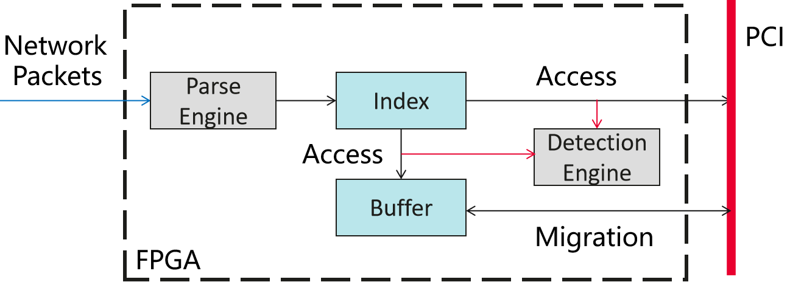

# FPGA-based data migration of network access

## Introduction & Scenario

将KV存储卸载到FPGA网卡，客户端可使用定制FPGA和RDMA直接访问服务器内存资源。旨在为分布式KV存储提供硬件协同辅助，通过FPGA加速远端内存访问，降低管理开销和访存延迟。

## Architecture

<i>架构图</i>

由图可知，FPGA作为网络和Host主机之间的中间件，直接处理特定的KV操作网络包，减少存储过程中CPU的使用。

## Design

1. 数据放置：将KV的Index存储在FPGA片上内存中，同时开辟少量高速缓存空间存储热数据。
2. 索引查询：解析引擎对网络指令解析并完成索引查询
3. 热度检测：检测引擎对访存过程进行检测，统计访存频率确认热点数据。

##### 功能：
* 解析接收的网络包。
* 根据网络包请求进行访存热数据检测。
* 热数据迁移至高速缓存。

## Implementation

由于环境和时间限制，使用模拟的方式进行测试，仅实现FPGA模块内的上述功能，实际不与网络和主机交互。
代码中func_WRITE()和func_READ()仅作为逻辑过程，不进行数据访问操作，

## Plan

第一&二周：利用HLS实现上述设计
第三周：   通过模拟测试验证上述功能

---

## Preliminary Results

test.c文件里编写了一个简单测试，验证热数据检测和替换的功能。仅作为对逻辑的测试，顺序访问三块长度为4个单位的内存地址1/2/3。

* 循环第一次i=10之后，三块内存依次进入片上缓存，热度排序分别为1/2/3
* 进行第二次i=10次之后，第一块内存的访问次数小于第二块内存(if（i>10）i=3),热度排序为2/1/3
* 进行第三次i=10次之后，第一块内存的访问次数小于第三块内存，热度排序为2/3/1

 热度排序结果维护在动态热度排序数组中，每次数据访问的时候进行更新。
 结果图1、2、3中的BufferOnchip.index值体现了这三个内存块热度排序的变化趋势。

